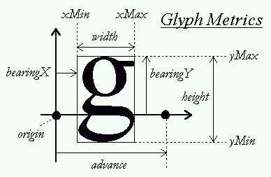

# Glyph Map
Provides glyph information according to specified char.

# core params in FreeType

| 属性 | 获取方式 | 生成位图描述 |
| -- | -- | -- |
| width | face->glyph->bitmap.width | 宽度，单位:像素 |
| height | face->glyph->bitmap.rows | 高度，单位:像素 |
| bearingX| face->glyph->bitmap_left| 水平位置(相对于起点origin)，单位:像素 |
| bearingY| face->glyph->bitmap_top | 垂直位置(相对于基线Baseline)，单位:像素 |
| advance | face->glyph->advance.x | 起点到下一个字形的起点间的距离(单位:1/64像素) |

