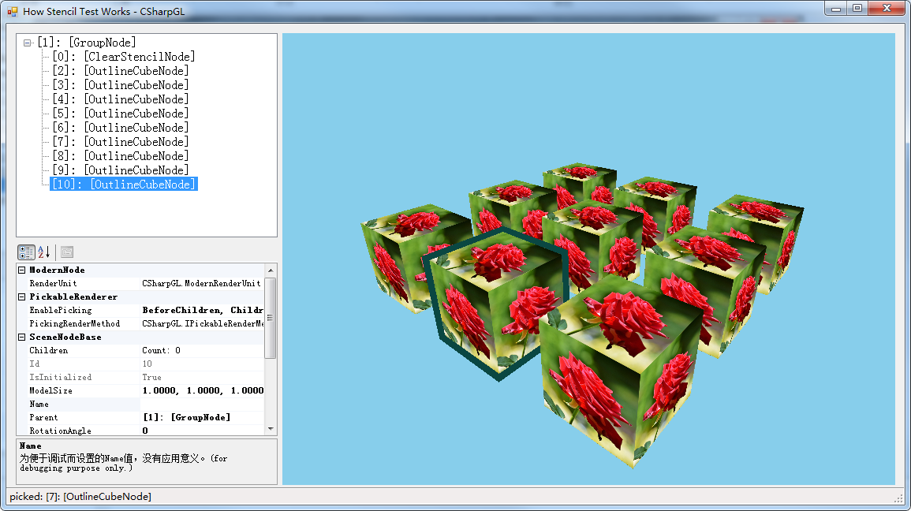

# Stencil Test.

This demo helped to make me understand how to create render context on Windows platform.
The clear command `glClear(GL_STENCIL_BUFFER_BIT);` seems not working. So I use 'ClearStencilNode' to clear stencil buffer.

